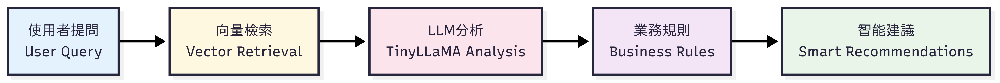

## Goods Inventory AI Agent

A Python-based AI agent for managing goods inventory, supporting natural language queries and smart recommendations.
### Technical Flow Diagram
Mermaid Chart2.png
### Features
- **Data Management**: Input inventory data for goods, stored in Supabase.
- **Smart Dialogue**: Answer questions like "Does Coke need restocking?" with rule-based suggestions.

### AI Highlights
- **Language Model**: TinyLLaMA-1.1B for response generation.
- **Vector Retrieval**: MiniLM-L6-v2 embeddings + Chroma database.
- **Workflow**: LangGraph for retrieval and analysis.

### Usage
1. Install: `pip install -r requirements.txt`.
2. Configure Supabase URL and Key.
3. Launch Gradio interface to input data or ask questions.

### Example
- Input: Coke, purchased 100, sold 60, expires 2025-06-12.
- Query: "Does Coke need restocking?"  
  Response: "Stock at 40 bottles, below 50—suggest restocking."

## 貨物進銷存 AI Agent

一個基於 Python 的 AI 代理，專為飲料進銷存管理設計，支援自然語言查詢與智能建議。

### 功能
- **數據管理**：輸入飲料進銷存資料，儲存至 Supabase。
- **智能對話**：回答如「可樂需要進貨嗎？」的問題，根據庫存規則提供建議。

### AI 特性
- **語言模型**：TinyLLaMA-1.1B 生成回應。
- **向量檢索**：MiniLM-L6-v2 嵌入 + Chroma 資料庫。
- **流程**：LangGraph 串聯檢索與分析。

### 使用
1. 安裝：`pip install -r requirements.txt`。
2. 配置 Supabase URL 與 Key。
3. 啟動 Gradio 介面，輸入資料或提問。

### 範例
- 輸入：可樂，進貨 100，銷貨 60，過期 2025-06-12。
- 問：「可樂需要進貨嗎？」  
  答：「庫存 40 瓶，低於 50，建議進貨。」

